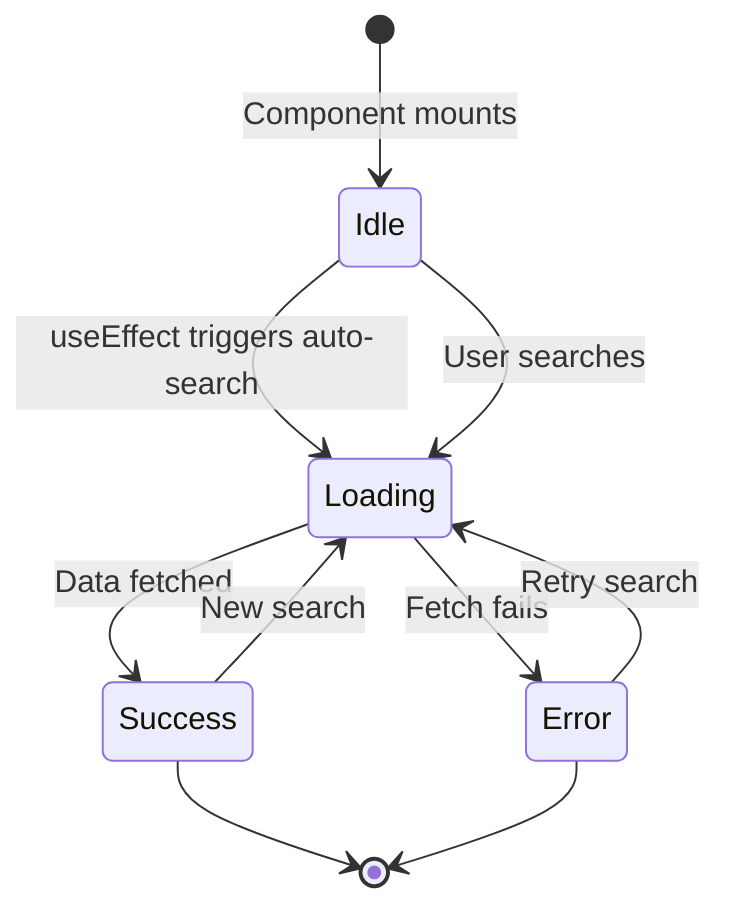

## Overview

The `useWeather` hook is a sophisticated custom hook that manages weather data fetching with a multi-step async workflow. It demonstrates advanced patterns including sequential API calls, localStorage integration, automatic data loading on mount, and comprehensive state management.

## Purpose

This hook showcases advanced React patterns for:

- Managing complex async workflows with multiple API calls
- Implementing localStorage for state persistence
- Auto-loading data on component mount with `useEffect`
- Using `useCallback` for stable function references
- Handling loading, success, and error states
- Coordinating geocoding and weather API calls

## API Reference

### Hook Signature

```typescript
useWeather(): UseWeatherReturn
```

### Parameters

This hook takes no parameters.

### Return Value

<ResponseField name="status" type="Status" required>
  Current state of the weather data fetching. Can be one of:
  - `'idle'`: No search performed yet
  - `'loading'`: Currently fetching data
  - `'success'`: Data fetched successfully
  - `'error'`: An error occurred during fetching
</ResponseField>

<ResponseField name="data" type="WeatherData | null" required>
  Weather data object when available. Contains:
  - `cityName`: string - Name of the city
  - `country`: string - Country code
  - `current`: CurrentWeatherData - Current weather information
    - `temperature_2m`: number - Temperature in Celsius
    - `wind_speed_10m`: number - Wind speed in km/h
    - `weather_code`: number - WMO weather code
  - `daily`: DailyForecastData - 7-day forecast
    - `time`: string[] - Array of dates
    - `temperature_2m_max`: number[] - Max temperatures
    - `temperature_2m_min`: number[] - Min temperatures
    - `weather_code`: number[] - Weather codes
</ResponseField>

<ResponseField name="error" type="string | null" required>
  Error message if status is 'error', otherwise null
</ResponseField>

<ResponseField name="search" type="(city: string) => Promise<void>" required>
  Async function to search weather for a given city. Performs geocoding first, then fetches weather data, and saves the city to localStorage.
</ResponseField>

<ResponseField name="savedCity" type="string" required>
  The last searched city name retrieved from localStorage (empty string if none)
</ResponseField>

## Implementation Details

<CodeGroup>
```typescript useWeather.ts
import { useState, useCallback, useEffect } from 'react';
import { geocodeCity, fetchWeather } from '../services/api';
import type { WeatherData, Status } from '../types/weather';

const LAST_CITY_KEY = 'weather-finder:last-city';

interface WeatherState {
  status: Status;
  data: WeatherData | null;
  error: string | null;
}

export function useWeather() {
  const [savedCity] = useState<string>(() => 
    localStorage.getItem(LAST_CITY_KEY) ?? ''
  );

  const [state, setState] = useState<WeatherState>({
    status: 'idle',
    data: null,
    error: null,
  });

  const search = useCallback(async (city: string) => {
    const trimmed = city.trim();
    if (!trimmed) return;

    setState({ status: 'loading', data: null, error: null });

    try {
      const { name, latitude, longitude, country } = await geocodeCity(trimmed);
      const { current, daily } = await fetchWeather(latitude, longitude);

      localStorage.setItem(LAST_CITY_KEY, trimmed);

      setState({
        status: 'success',
        data: { cityName: name, country, current, daily },
        error: null,
      });
    } catch (err) {
      setState({
        status: 'error',
        data: null,
        error: err instanceof Error ? err.message : 'Ocurrió un error inesperado.',
      });
    }
  }, []);

  // Auto-search the last city on mount
  useEffect(() => {
    const lastCity = localStorage.getItem(LAST_CITY_KEY);
    if (lastCity) search(lastCity);
  }, [search]);

  return { ...state, search, savedCity };
}
```

```typescript weather.ts (types)
export interface GeocodingResult {
  id: number;
  name: string;
  latitude: number;
  longitude: number;
  country: string;
  admin1?: string;
}

export interface CurrentWeatherData {
  temperature_2m: number;
  wind_speed_10m: number;
  weather_code: number;
}

export interface DailyForecastData {
  time: string[];
  temperature_2m_max: number[];
  temperature_2m_min: number[];
  weather_code: number[];
}

export interface WeatherData {
  cityName: string;
  country: string;
  current: CurrentWeatherData;
  daily: DailyForecastData;
}

export type Status = 'idle' | 'loading' | 'success' | 'error';
```
</CodeGroup>

### Key Implementation Details

<AccordionGroup>
  <Accordion title="Lazy Initialization of savedCity">
    The hook uses lazy initialization to read from localStorage only once:
    ```typescript
    const [savedCity] = useState<string>(() => 
      localStorage.getItem(LAST_CITY_KEY) ?? ''
    );
    ```
    This prevents reading localStorage on every render.
  </Accordion>
  
  <Accordion title="Unified State Object">
    Instead of separate state variables, the hook uses a single state object:
    ```typescript
    const [state, setState] = useState<WeatherState>({
      status: 'idle',
      data: null,
      error: null,
    });
    ```
    This ensures all related values update atomically, preventing intermediate states.
  </Accordion>
  
  <Accordion title="useCallback for Stable Reference">
    The `search` function is wrapped in `useCallback` with an empty dependency array:
    ```typescript
    const search = useCallback(async (city: string) => {
      // ...
    }, []);
    ```
    This provides a stable function reference that won't change between renders, crucial for the `useEffect` dependency.
  </Accordion>
  
  <Accordion title="Sequential API Calls">
    The hook performs two sequential API calls:
    ```typescript
    // 1. Geocode the city name to get coordinates
    const { name, latitude, longitude, country } = await geocodeCity(trimmed);
    
    // 2. Use coordinates to fetch weather data
    const { current, daily } = await fetchWeather(latitude, longitude);
    ```
    The second call depends on the first, demonstrating async dependency management.
  </Accordion>
  
  <Accordion title="Auto-Loading on Mount">
    The hook automatically loads weather for the last searched city:
    ```typescript
    useEffect(() => {
      const lastCity = localStorage.getItem(LAST_CITY_KEY);
      if (lastCity) search(lastCity);
    }, [search]);
    ```
    This provides a seamless user experience by restoring the previous state.
  </Accordion>
  
  <Accordion title="Comprehensive Error Handling">
    Errors are caught and properly typed:
    ```typescript
    error: err instanceof Error ? err.message : 'Ocurrió un error inesperado.'
    ```
    This ensures type safety while handling both Error objects and other thrown values.
  </Accordion>
</AccordionGroup>

## Usage Examples

### Basic Usage

<Tabs>
  <Tab title="App Component">
    ```tsx App.tsx
    import { useWeather } from './hooks/useWeather';
    import { SearchBar } from './components/SearchBar';
    import { CurrentWeather } from './components/CurrentWeather';
    import { WeatherForecast } from './components/WeatherForecast';
    import { LoadingSpinner } from './components/LoadingSpinner';
    import { ErrorMessage } from './components/ErrorMessage';
    import './App.css';

    function App() {
      const { status, data, error, search, savedCity } = useWeather();

      return (
        <div className="app">
          <header className="app-header">
            <h1 className="app-title">
              <span aria-hidden="true">🌤️</span> Weather Finder
            </h1>
            <p className="app-subtitle">
              Consulta el clima de cualquier ciudad del mundo
            </p>
          </header>

          <main className="app-main">
            <SearchBar
              onSearch={search}
              isLoading={status === 'loading'}
              initialValue={savedCity}
            />

            <div className="app-content">
              {status === 'idle' && (
                <div className="idle-state">
                  <span className="idle-emoji" aria-hidden="true">🌍</span>
                  <p>Busca una ciudad para ver su pronóstico del tiempo</p>
                </div>
              )}

              {status === 'loading' && <LoadingSpinner />}

              {status === 'error' && error && <ErrorMessage message={error} />}

              {status === 'success' && data && (
                <>
                  <CurrentWeather data={data} />
                  <WeatherForecast daily={data.daily} />
                </>
              )}
            </div>
          </main>
        </div>
      );
    }

    export default App;
    ```
  </Tab>
  
  <Tab title="SearchBar Component">
    ```tsx SearchBar.tsx
    import { useState, FormEvent } from 'react';

    interface SearchBarProps {
      onSearch: (city: string) => Promise<void>;
      isLoading: boolean;
      initialValue?: string;
    }

    export const SearchBar = ({ 
      onSearch, 
      isLoading, 
      initialValue = '' 
    }: SearchBarProps) => {
      const [city, setCity] = useState(initialValue);

      const handleSubmit = async (e: FormEvent) => {
        e.preventDefault();
        if (city.trim()) {
          await onSearch(city);
        }
      };

      return (
        <form onSubmit={handleSubmit} className="search-form">
          <input
            type="text"
            value={city}
            onChange={(e) => setCity(e.target.value)}
            placeholder="Enter city name..."
            disabled={isLoading}
            className="search-input"
          />
          <button 
            type="submit" 
            disabled={isLoading || !city.trim()}
            className="search-button"
          >
            {isLoading ? 'Searching...' : 'Search'}
          </button>
        </form>
      );
    };
    ```
  </Tab>
  
  <Tab title="CurrentWeather Component">
    ```tsx CurrentWeather.tsx
    import type { WeatherData } from '../types/weather';

    interface CurrentWeatherProps {
      data: WeatherData;
    }

    export const CurrentWeather = ({ data }: CurrentWeatherProps) => {
      const { cityName, country, current } = data;

      return (
        <div className="current-weather">
          <h2>{cityName}, {country}</h2>
          <div className="weather-info">
            <div className="temperature">
              {Math.round(current.temperature_2m)}°C
            </div>
            <div className="details">
              <p>Wind: {current.wind_speed_10m} km/h</p>
              <p>Code: {current.weather_code}</p>
            </div>
          </div>
        </div>
      );
    };
    ```
  </Tab>
  
  <Tab title="WeatherForecast Component">
    ```tsx WeatherForecast.tsx
    import type { DailyForecastData } from '../types/weather';

    interface WeatherForecastProps {
      daily: DailyForecastData;
    }

    export const WeatherForecast = ({ daily }: WeatherForecastProps) => {
      return (
        <div className="weather-forecast">
          <h3>7-Day Forecast</h3>
          <div className="forecast-grid">
            {daily.time.map((date, index) => (
              <div key={date} className="forecast-day">
                <p className="date">{new Date(date).toLocaleDateString()}</p>
                <p className="temp-max">
                  {Math.round(daily.temperature_2m_max[index])}°
                </p>
                <p className="temp-min">
                  {Math.round(daily.temperature_2m_min[index])}°
                </p>
              </div>
            ))}
          </div>
        </div>
      );
    };
    ```
  </Tab>
</Tabs>

### Advanced Usage with Custom Hook Composition

```tsx useWeatherWithHistory.ts
import { useState, useCallback } from 'react';
import { useWeather } from './useWeather';

interface SearchHistoryItem {
  city: string;
  timestamp: number;
  data: WeatherData;
}

export const useWeatherWithHistory = () => {
  const weather = useWeather();
  const [history, setHistory] = useState<SearchHistoryItem[]>([]);

  const searchWithHistory = useCallback(async (city: string) => {
    await weather.search(city);
    
    // Add to history after successful search
    if (weather.status === 'success' && weather.data) {
      setHistory(prev => [
        { city, timestamp: Date.now(), data: weather.data! },
        ...prev.slice(0, 9) // Keep last 10
      ]);
    }
  }, [weather]);

  const loadFromHistory = (item: SearchHistoryItem) => {
    // Directly set the cached data without making a new API call
    // This would require modifying the original hook or managing state differently
  };

  return {
    ...weather,
    search: searchWithHistory,
    history,
    loadFromHistory,
  };
};
```

## Design Patterns

<Note>
  This hook demonstrates several advanced React patterns:
</Note>

### 1. Unified State Management

Instead of managing loading, data, and error separately:

```typescript
// ✅ Better: Atomic updates, no intermediate states
const [state, setState] = useState<WeatherState>({
  status: 'idle',
  data: null,
  error: null,
});

// ❌ Worse: Multiple setState calls can create intermediate states
const [loading, setLoading] = useState(false);
const [data, setData] = useState(null);
const [error, setError] = useState(null);
```

### 2. Lazy State Initialization

Reading localStorage only once during initialization:

```typescript
const [savedCity] = useState<string>(() => 
  localStorage.getItem(LAST_CITY_KEY) ?? ''
);
```

### 3. Stable Function References with useCallback

Preventing infinite loops in useEffect:

```typescript
const search = useCallback(async (city: string) => {
  // Implementation
}, []); // Empty deps means stable reference

useEffect(() => {
  // Safe to use search in deps because it never changes
  if (lastCity) search(lastCity);
}, [search]);
```

### 4. Sequential Async Operations

Chaining dependent API calls:

```typescript
const geocode = await geocodeCity(trimmed);
const weather = await fetchWeather(geocode.latitude, geocode.longitude);
```

### 5. Type-Safe Error Handling

```typescript
error: err instanceof Error ? err.message : 'Ocurrió un error inesperado.'
```

## State Flow Diagram



## Performance Considerations

<AccordionGroup>
  <Accordion title="Preventing Unnecessary Renders">
    Using `useCallback` with empty deps ensures the `search` function doesn't change, preventing child components from re-rendering unnecessarily.
  </Accordion>
  
  <Accordion title="Lazy Initialization">
    The lazy initialization pattern for `savedCity` ensures localStorage is only read once, not on every render.
  </Accordion>
  
  <Accordion title="Atomic State Updates">
    The unified state object ensures all related values update together, preventing multiple renders from separate setState calls.
  </Accordion>
  
  <Accordion title="Auto-Loading Trade-off">
    The auto-load feature on mount improves UX but makes an API call immediately. Consider adding a delay or user preference to control this behavior.
  </Accordion>
</AccordionGroup>

## Best Practices Demonstrated

<Check>This hook exemplifies several React best practices:</Check>

1. **TypeScript for Type Safety**: All types are properly defined
2. **Unified State**: Related state values are kept together
3. **Stable References**: Functions are memoized with useCallback
4. **Lazy Initialization**: Expensive operations only run once
5. **Proper Error Handling**: Try-catch with type-safe error messages
6. **Side Effect Management**: useEffect for auto-loading
7. **localStorage Integration**: Persistent user preferences
8. **Input Validation**: Trimming and checking for empty strings

## Potential Enhancements

<Warning>
  Consider these improvements for production:
</Warning>

1. **Debouncing**: Add debouncing to prevent excessive API calls
2. **Request Cancellation**: Cancel in-flight requests on new search
3. **Cache with Expiration**: Cache results with TTL to reduce API calls
4. **Retry Logic**: Implement automatic retry on failure
5. **Optimistic Updates**: Show loading state with previous data
6. **Request Deduplication**: Prevent duplicate concurrent requests

```typescript
// Example: Adding cache with expiration
interface CacheEntry {
  data: WeatherData;
  timestamp: number;
}

const cache = useRef<Record<string, CacheEntry>>({});
const CACHE_TTL = 10 * 60 * 1000; // 10 minutes

// Check cache before fetching
const cached = cache.current[city];
if (cached && Date.now() - cached.timestamp < CACHE_TTL) {
  setState({ status: 'success', data: cached.data, error: null });
  return;
}
```

## Related Hooks

<CardGroup cols={2}>
  <Card title="useCounter" icon="hashtag" href="/hooks/use-counter">
    Learn basic custom hook patterns
  </Card>
  <Card title="useGifs" icon="images" href="/hooks/use-gifs">
    Explore caching patterns with useRef
  </Card>
</CardGroup>